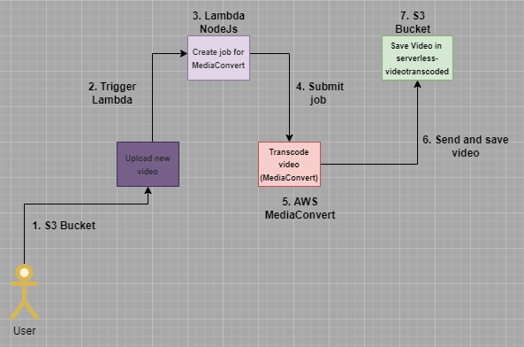

# 1. videoconvert-in-serverless-lambda

El backend en este repositorio es una aplicación que esta construida con **AWS S3, MediaConvert, Lambda,** y su funcionalidad principal es transcodificar un video en diferentes formatos.

Cabe aclarar que esta aplicacion esta construida sobre serverless y es altamente escalable.

## 2. Flujo de la aplicación.

- El usuario carga un video directamente al buckert S3
- Al estar cargado el video se dispara un trigger.
- A la lambda le llega un evento con información sobre el video que se cargo.
- Al ejecutarse la lambda, se le envia un job al servicio AWS MediaConvert para que sepa que hacer. 
- El servicio AWS MediaConvert recibe el job con el tipo de conversión que debe hacer y donde debe dejar los videos con los nuevos formatos, para este caso son tres (3) formatos que vamos a manejar con diferentes resoluciones, tasa de bit, etc.
- Luego de eso se enviar los video al bucket de salida, este proceso puede tardar minutos o horas dependiendo de la calidad, duración u otras caracteristicas del video.
- Al final del flujo se dejan los tres (3) videos en el bucket S3 con las especificaciones que se le indico desde la lambda.

## 2. Colocando todo en marcha.

Voy a asumir que ya tienes NPM y Node js instalado en tu maquina, vamos a proceder a instalar Serverless Framework.

Serverless Framework es una herramienta de linea de comando que te permite desarrollar y supervizar facilmente aplicaciones serverless.

Para instalar solo tienes que ejecutar el siguiente comando:

> npm install -g serverless

Ya teniendo serverless instalado, procede a clonar este repositorio y te ubicas dentro de la carpeta del mismo.

Estando dentro del directorio podemos proceder a desplegar toda la arquitectura de nuestros backend pero antes de eso hay que echarle manos a configurar ciertas cosas en el servicio IAM de AWS para que todo funcione correctamente, empecemos:

- Estando dentro del servicio IAM de AWS vamos a configurar dos roles: (media-convert-role, transcode-video), el primero es para el servicio AWS MediaConvert y el segundo es para la lambda.

- A (transcode-video) le agregamos dos politicas [AmazonS3FullAccess, AmazonAPIGatewayInvokeFullAccess] para que el servicio AWS MediaConvert pueda acceder a los bucket S3.

- A (transcode-video) le agreamos dos politicas [AWSElementalMediaConvertFullAccess, AWSLambdaExecute] para que pueda consumir el servicio AWS MediaConvert y permisos de ejecución de la lambda.

Luego de esto usted necesitara tener su maquina configurar para que se pueda conectar a AWS, si no la tiene puede revisar esta documentación de AWS que lo explica correctamente [https://docs.aws.amazon.com/cli/latest/userguide/cli-configure-files.html], lo unico aqui a recordar que el usuario que vaya a configurar en su maquina local tenga permisos de administrador [AdministratorAccess] para que no vaya a tener problemas al desplegar la aquitectura.

- Un ultimo paso para poder desplegar todo en setear correctamente el archivo serverless.yml.

